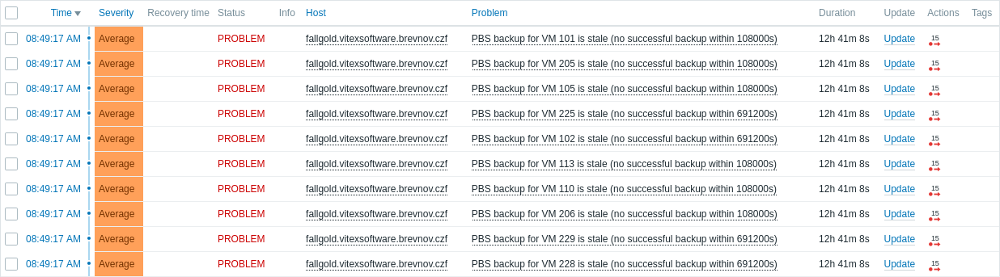

# pbs-zabbix


Zabbix monitoring for [Proxmox Backup Server](https://www.proxmox.com/en/proxmox-backup-server)
(PBS). Alerts when a scheduled backup did not complete successfully — including
the case where it never even started (e.g. the network path between the
hypervisor and the PBS datastore was down).

## How it works

`pbs-zabbix-backup-check` reads Proxmox Backup Server task logs directly from
`/var/log/proxmox-backup/tasks`. Those files are world-readable, so the tool
needs no root privileges and does not call the PBS API.

It supports three modes, wired into Zabbix Agent 2 via
[`zabbix/pbs-backup.conf`](zabbix/pbs-backup.conf):

- `discovery` — Zabbix low-level discovery (LLD): lists `{#VMID}` for every
  VM/CT that has at least one recorded backup task.
- `age <vmid>` — seconds since the last **successful** (`TASK OK`) backup of
  `vmid`. Returns a large sentinel value if no successful backup was ever
  recorded, so a staleness trigger fires immediately.
- `status <vmid>` — the last recorded task line for `vmid` (success or
  failure), for alert context.

## Installing

```sh
apt install pbs-zabbix
systemctl restart zabbix-agent2
```

## Zabbix setup

The package installs a ready-to-import template at
`/usr/share/pbs-zabbix/zabbix/template_pbs_backup.yaml`. On the Zabbix
server: **Data collection → Templates → Import** it, then link it to the PBS
host. It provides:

- A discovery rule (`pbs.backup.discovery`) with item prototypes
  `pbs.backup.age[{#VMID}]` (Numeric, unsigned, units `s`) and
  `pbs.backup.laststatus[{#VMID}]` (Text).
- A trigger prototype that fires when a backup is either stale **or**
  simply missing data:

  ```
  last(/<host>/pbs.backup.age[{#VMID}])>{$PBS.BACKUP.MAXAGE:"{#VMID}"}
  or nodata(/<host>/pbs.backup.age[{#VMID}],{$PBS.BACKUP.MAXAGE:"{#VMID}"})=1
  ```

  The `nodata()` half matters: a plain `last()` comparison only re-evaluates
  when new data arrives, so if PBS never even ran the backup (host powered
  off, network path down, agent unreachable) the item just stops updating
  and `last()` silently freezes below the threshold, never alerting. This
  is *not* a "PBS host must always be up" check — a host that is normally
  powered off and only wakes for its nightly backup is expected to report
  at least once per `{$PBS.BACKUP.MAXAGE}` window, so it will not
  false-alarm during its normal off periods; it only fires if a full window
  passes with no confirmed backup at all.
- A user macro `{$PBS.BACKUP.MAXAGE}` (default `108000`, 30 hours) which
  covers both the staleness threshold and the `nodata()` window. Use
  context overrides (`{$PBS.BACKUP.MAXAGE:"<vmid>"}`) for VMs/CTs on a
  different backup cadence (e.g. weekly jobs).

If the PBS host is only powered on intermittently (e.g. nightly), configure
`zabbix-agent2` there for **active checks** (`ServerActive=<zabbix-server>`
in `zabbix_agent2.conf`) rather than relying on the server polling it
passively — otherwise the server may simply miss the host's short wake
window, which delays data as much as an actual outage would.

Resulting alerts in the Zabbix problem view:



## License

MIT — see [LICENSE](LICENSE).
